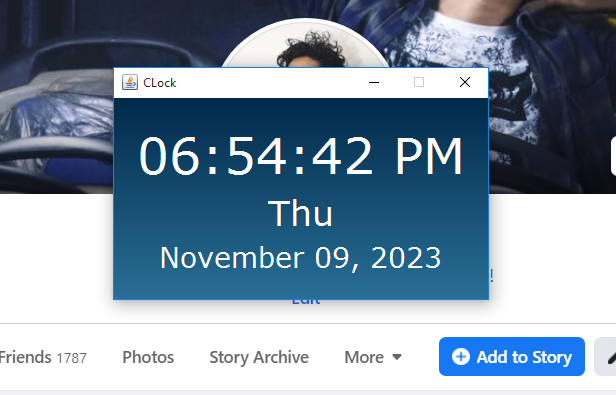

# Java Swing Clock Application

This is a simple Java Swing application that displays the current time, day, and date. It features a stylish gradient background and a pleasant color scheme.

## Screenshots

Here is a preview of the application:

## Features

- Real-time display of time, day, and date.
- Stylish gradient background.
- Pleasant color scheme.

## How to Use

1. Clone this repository to your local machine.
2. Compile and run the `MyFrame.java` file using your Java development environment (e.g., Eclipse, IntelliJ IDEA, or VSCode with Java extension).

## Author

- [Asadullah Imran](https://github.com/Asadullah-Imran) 

[//]: # (- [Portfolio Website]&#40;https://yourportfolio.com&#41;)

## License

This project is licensed under the [MIT License](https://github.com/Asadullah-Imran/Java_miniprojects/blob/main/LICENSE).
