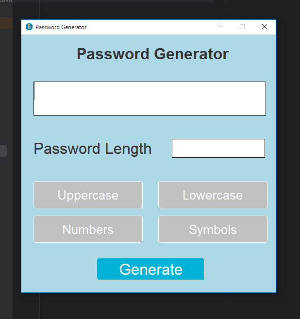
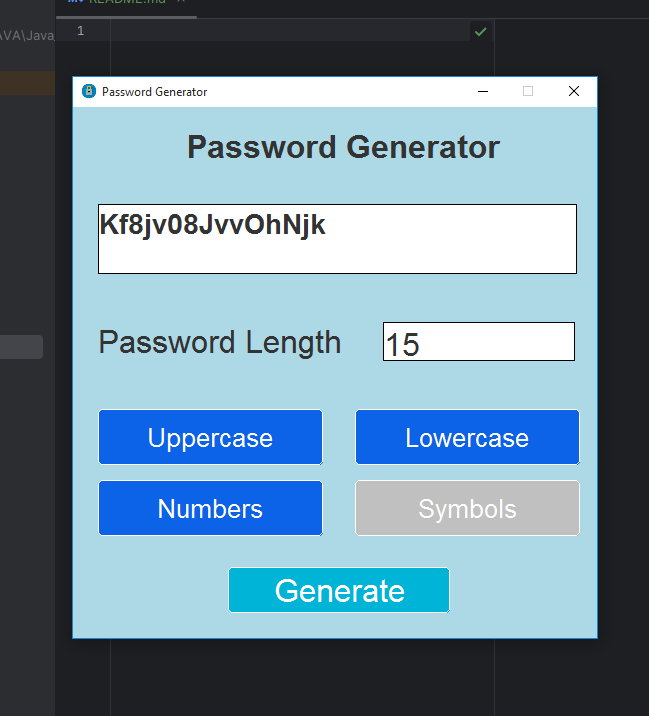
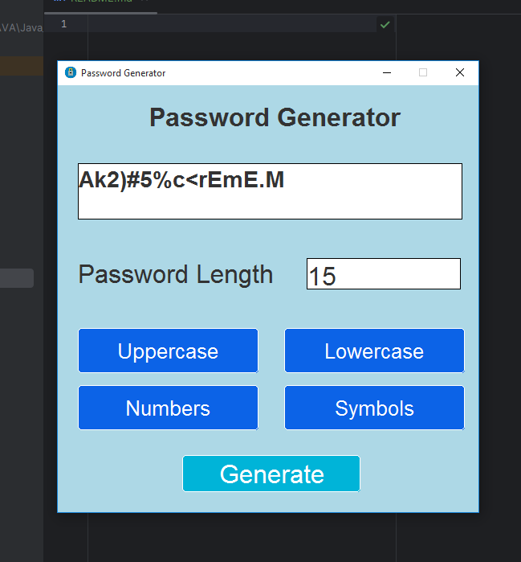

# Password Generator GUI

A simple Java Swing application for generating passwords with a user-friendly graphical interface.

## Table of Contents

- [Features](#features)
- [Screenshots](#screenshots)
- [How to Use](#how-to-use)
- [Contributing](#contributing)
- [Author](#author)
- [License](#license)

## Features

- Password generation with customizable length.
- Toggle options for including uppercase letters, lowercase letters, numbers, and symbols.
- User-friendly GUI with rounded buttons and toggle buttons.
- ...

## Screenshots


*This is the first look.*


*You can add how much character you want.*

*you can add uppercase , lowercase, numbers, symbols anything you want to add in your password.*
...

## How to Use

1. Clone the repository to your local machine.
   ```bash
   git clone https://github.com/Asadullah-Imran/Java_miniprojects/tree/main/PasswordGeneratorApp.git

2. Open the project in your favorite Java IDE.

3. Run the PasswordGeneratorGUI class to start the application.

4. Customize password options using toggle buttons and set the desired length.

5. Click the "Generate" button to create a password.


...
## Contributing
If you'd like to contribute to this project, please follow these steps:

1. Fork the repository on GitHub.
2. Clone your forked repository to your local machine.

3. Create a new branch for your feature/bug fix.

4. Commit your changes and push to your fork.

5. Submit a pull request from your branch to the original repository.


## Author

- [Asadullah Imran](https://github.com/Asadullah-Imran)

[//]: # (- [Portfolio Website]&#40;https://yourportfolio.com&#41;)

## License

This project is licensed under the [MIT License](https://github.com/Asadullah-Imran/Java_miniprojects/blob/main/LICENSE).
