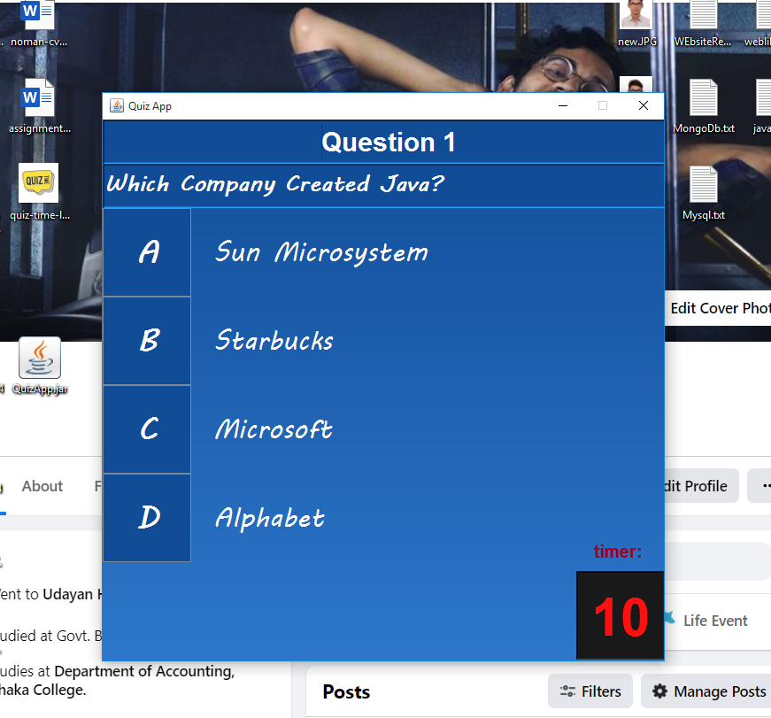
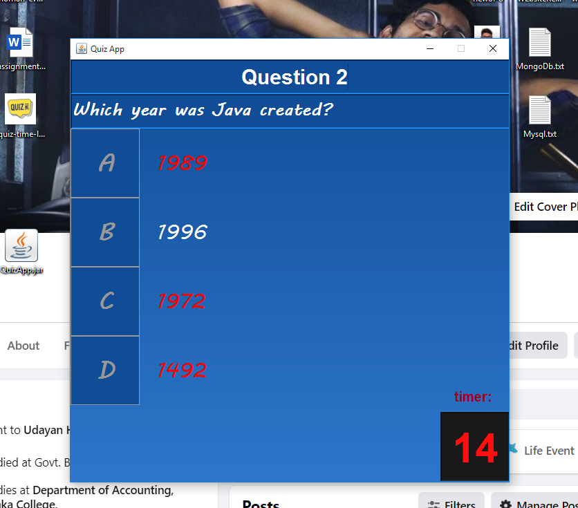
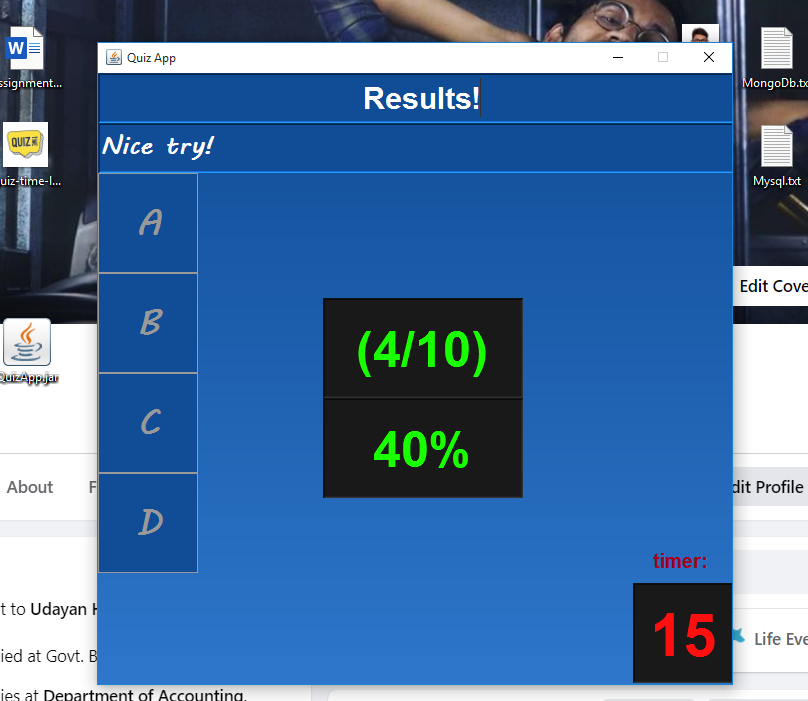

# Java Quiz App

This is a simple Java quiz application built using Swing for creating a GUI. It presents a series of multiple-choice questions to the user, tracks their answers, and displays the results.

## Features

- Multiple-choice questions with options.
- Timer for each question.
- Scoring and results display.
- A gradient background for an attractive UI.

## Screenshots

## Demo Video

## Usage

1. Clone the repository to your local machine.
2. Open the project in your preferred Java IDE.
3. Build and run the `Main.java` file to start the quiz.

## How to Contribute

If you'd like to contribute to this project, you can follow these steps:

1. Fork the repository.
2. Create a new branch for your feature or bug fix.
3. Make your changes and commit them.
4. Push your changes to your fork.
5. Create a pull request to this repository.

## License

This project is licensed under the MIT License. You can find more details in the [LICENSE](LICENSE) file.

## Author

- Asadullah Imran

Feel free to update this README with more details about your project, usage instructions, or any other relevant information.
